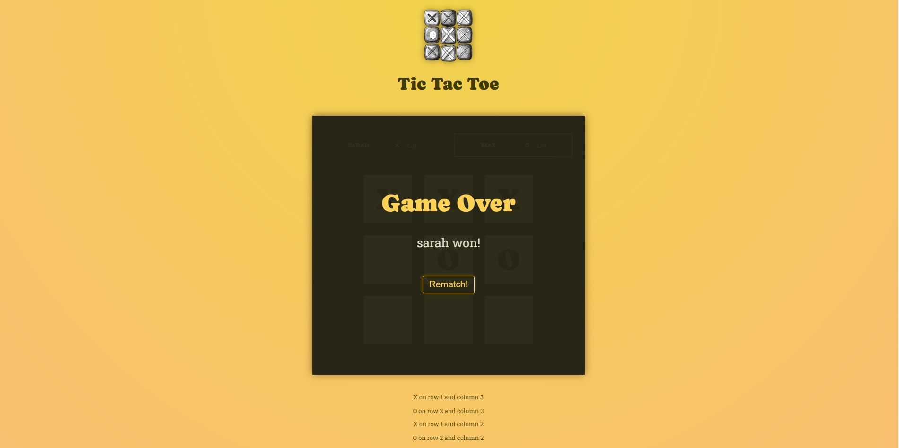

<h1 align="center"> Tic Tac Toe </h1>

<p align="center">
Tic Tac Toe is an application developed during the React - The Complete Guide 2024 (incl. React Router and Redux), provided Academind by Maximilian Schwarzmüller, a course that I'm studying for a even better React comprehension and knowledge. <br/><br/>
</p>

<p align="left">For this project we took a Deep Dive into React Concepts, such as:

- Fragments
- How to Split Components
- Forwarding Props
- JSX Slots
- Setting Types Dynamically 
- Default Props Values
- /public vs /assets
- Working with States
- Working With Isolation
- Conditional Rendering
- Updating States Based on Old States (Best Practice)
- Two-Way Binding
- Updating Object State Immutably (Best Practice)
- Lifting State Up
- Deriving States from Props
- With Data to Outsource
- Lifting Computed Values Up
- Why Immutability Matters
</p>

<p align="center">
  <a href="#-technologies">Technologies</a>&nbsp;&nbsp;&nbsp;|&nbsp;&nbsp;&nbsp;
  <a href="#-deploy">Deploy</a>&nbsp;&nbsp;&nbsp;|&nbsp;&nbsp;&nbsp;
  <a href="#-portugese-version">Portuguese Version</a>&nbsp;&nbsp;&nbsp;&nbsp;&nbsp;&nbsp;
</p>

<p align="center">
  
</p>

## 🚀 Technologies

This project was developed using:

- React
- Javascript
- CSS
- ViteJS

## 💻 Deploy

> [Click here to view the project!](https://tic-tac-toe-delta-five-65.vercel.app/)


<!-- ## 💻 Rode Local
---
Para rodar o projeto localmente, basta cumprir as seguintes etapas:

1. Git clone
2. Git install
3. Npm start -->

## 🌎 Versão em Português

React Essentials é uma aplicação desenvolvida no primeiro módulo do curso React - The Complete Guide 2024 (incl. React Router and Redux), provided Academind by Maximilian Schwarzmüller, um curso que estou fazendo com a intenção de melhorar ainda mais minha compreensão e conhecimentos em React. Durante esse projeto foram utilizadas as seguintes tecnologias:
- React, Javascript, CSS e ViteJS

Para ver a aplicação rodando é só [clicar aqui](https://tic-tac-toe-delta-five-65.vercel.app/) !
<!-- or run locally following these steps:
```
ETAPAS PARA RODAR LOCAL EM PROJETOS MAIS COMPLEXOS
```  -->

---
### Developed by Sarah Schneider 🖖